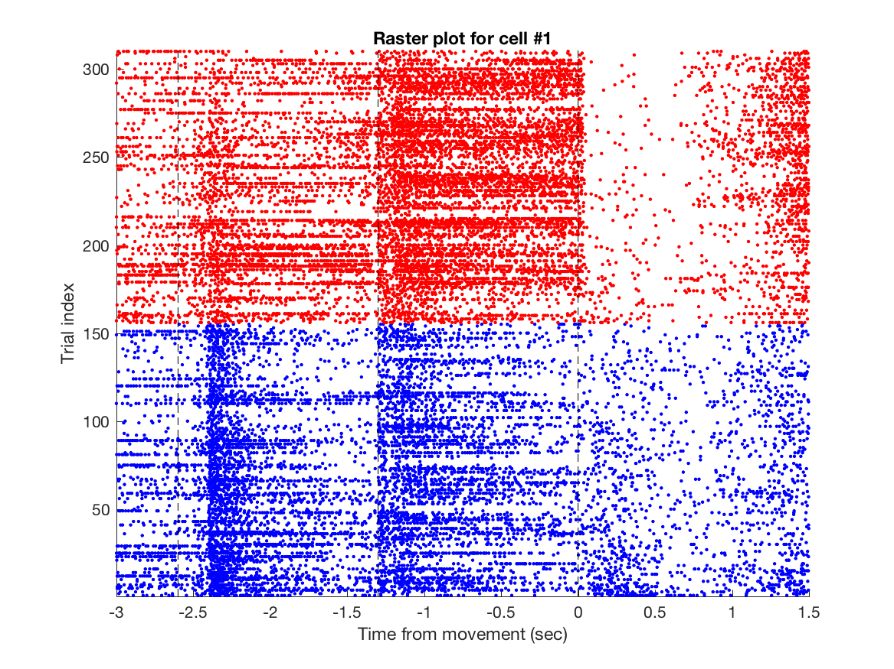
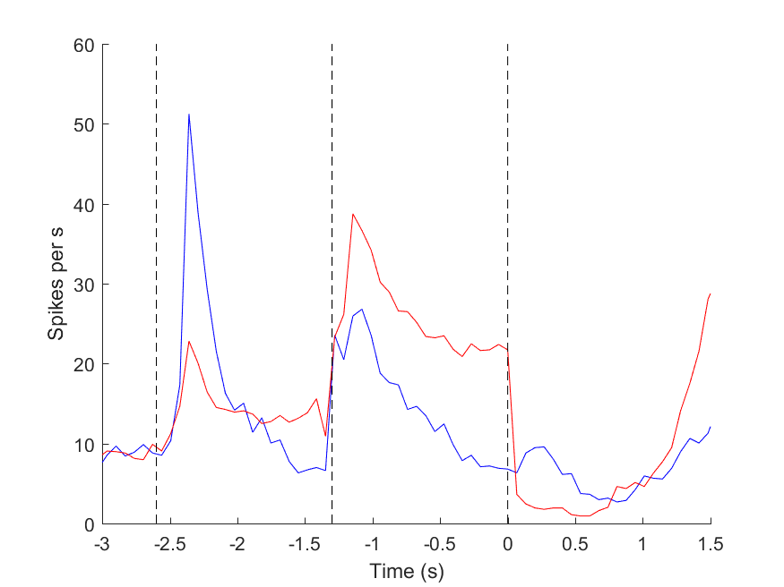
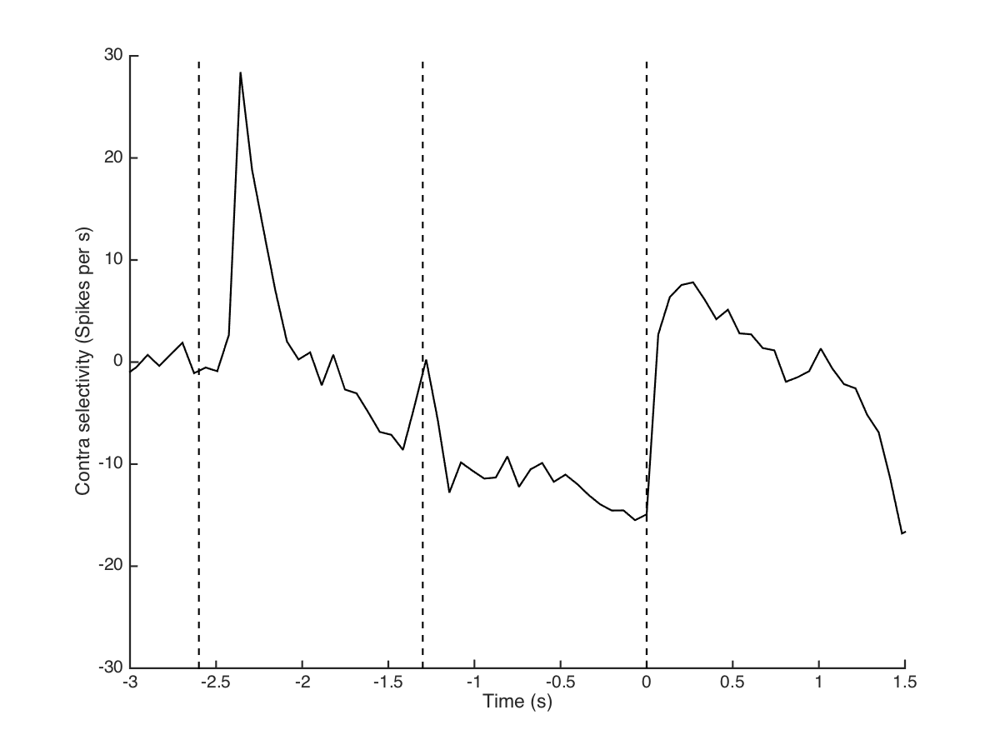
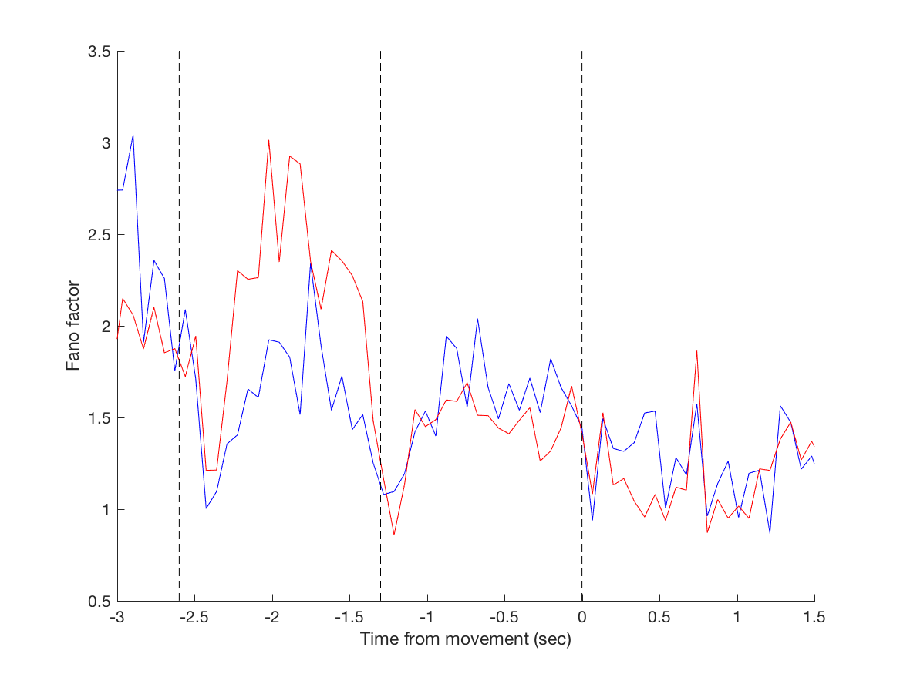
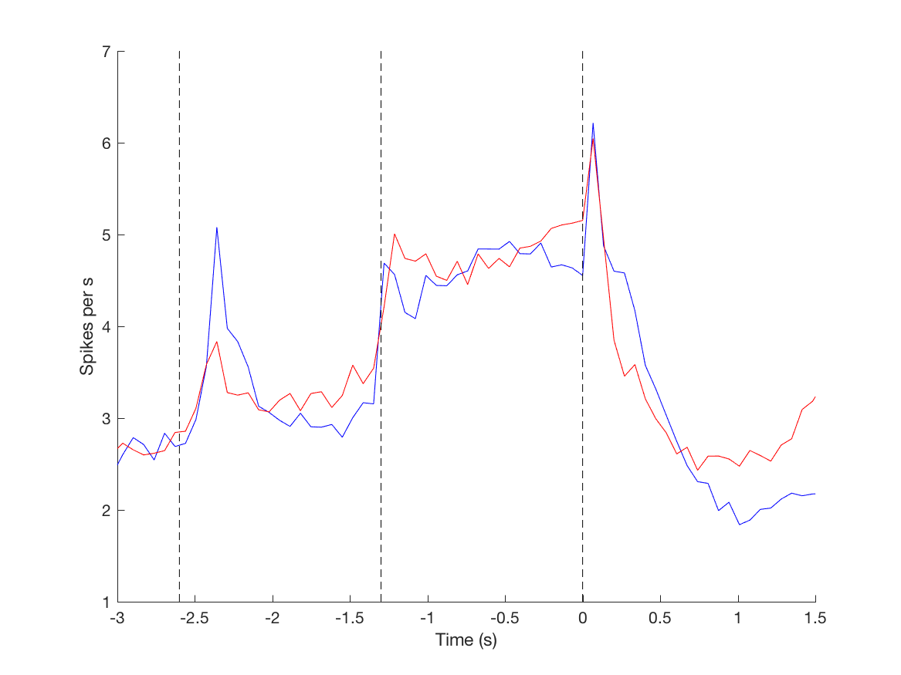
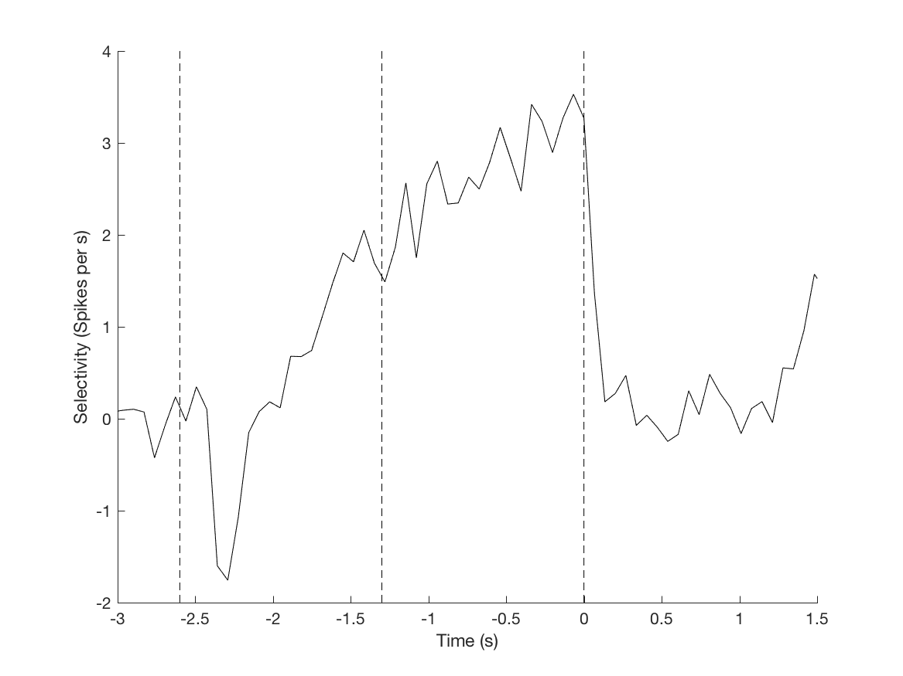
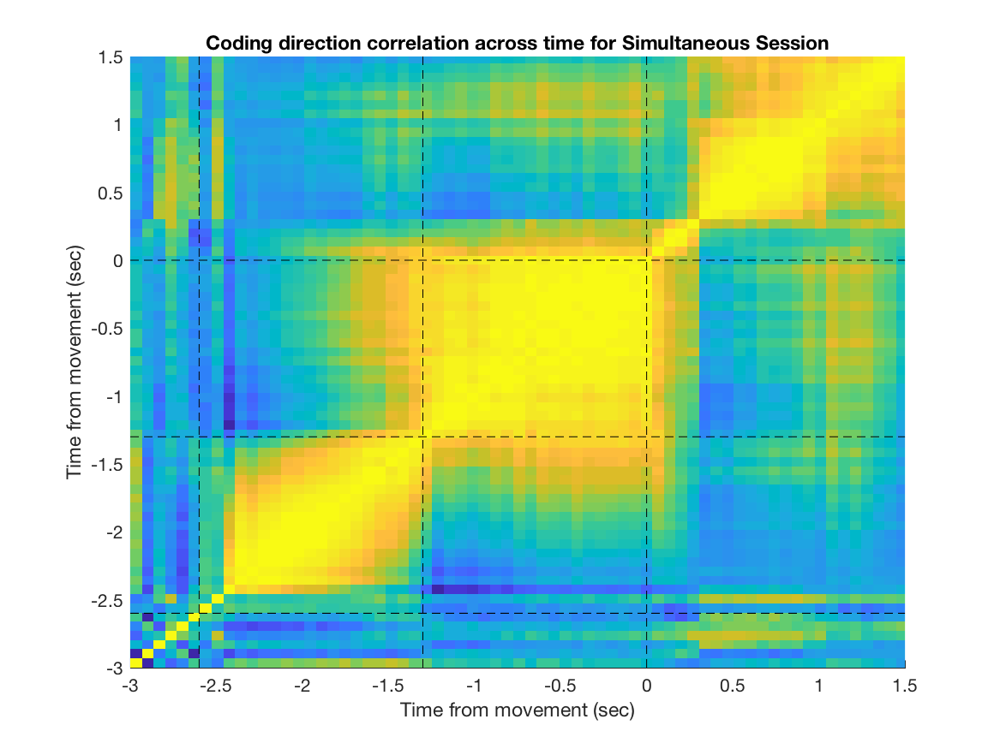
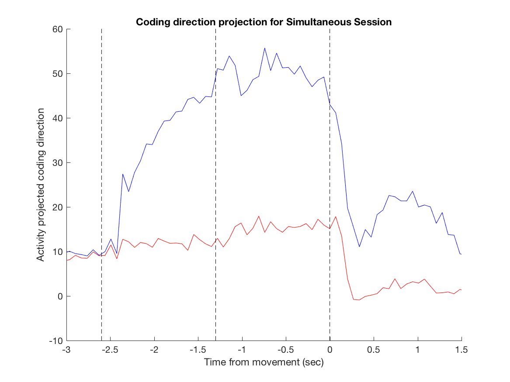
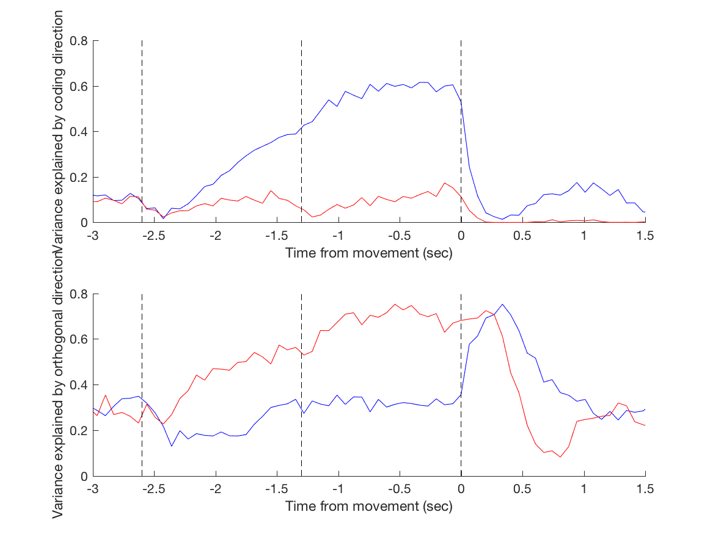
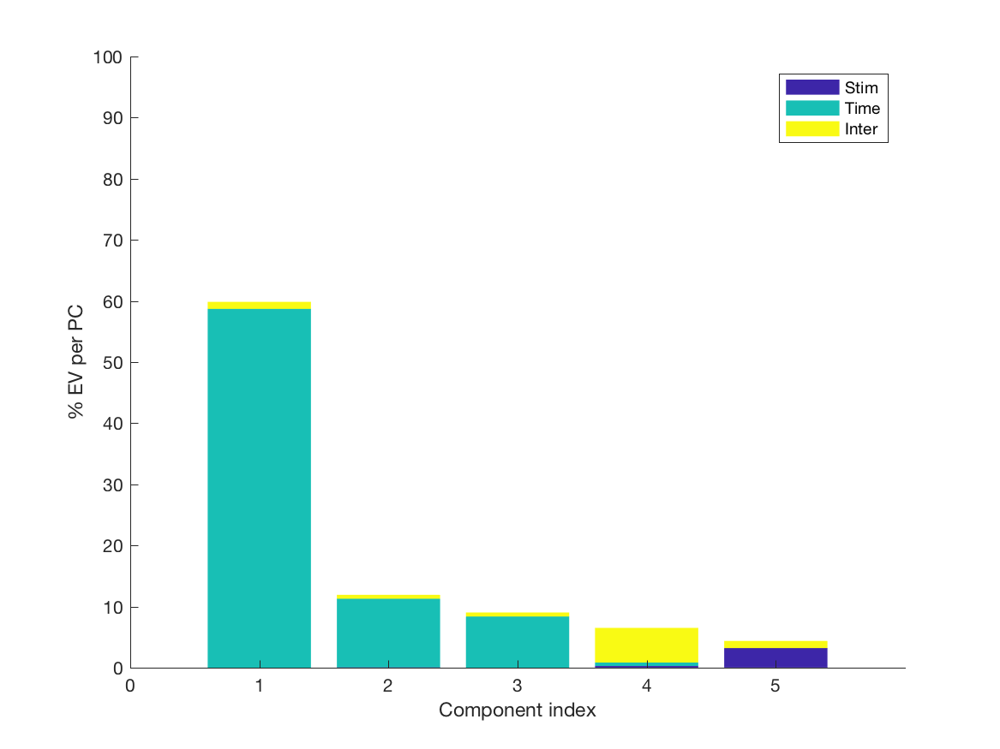

# explore ephys data
This is repo for the hand-on lecture on 08/21.

## Dataset Description
### Task description:
* Tactile delayed response task
* A pole is presented to whiskers of an animal during a "sample epoch". The location of pole instructs the animal which direction to lick (left or right).
* The sample epoch was followed by a "delay epoch", while the animal was trained not to move.
* At the beginning of a "response poch", a brief "go cue" (100ms)instructs the animal to move.


### Task structure:
* Pre-sample: -3.1 to -2.6 sec.
* Sample: -2.6 to -1.3 sec.
* Delay: -1.3 to 0 sec.
* Response: 0 - 2 sec.

### Data structure:
* All cells in exemplary analyses are stored in an array named __ephysDataset__
* Cell index: index of cell in the __ephysDataset__ array.
* sessionIndex : index of the session which neuron is recorded. Each session is recorded by JRC multi-electrode arrays (64 channels).
* nUnit: index of the neuron(unit) in each recording session.
* unit_yes_trial: correct right-lick trial (contra-laterial behavior trial) where spike count is binned by 67 ms discretely in time.
* unit_no_trial: correct left-lick trial (ipsi-laterial behavior trial) where spike count is binned by 67 ms discretely in time.
* unit_yes_trial_index: trial index for each correct right-lick trial.
* unit_no_trial_index: trial index for each correct left-lick trial.
* unit_yes_trial_spk_time: spike times for each neuron/unit in a correct right-lick trial (unit in sec).
* unit_no_trial_spk_time: spike times for each neuron/unit in a correct left-lick trial (unit in sec).
* unit_yes_error: error right-lick trial (contra-laterial behavior trial) where spike count is binned by 67 ms discretely in time.
* unit_no_error: error left-lick trial (ipsi-laterial behavior trial) where spike count is binned by 67 ms discretely in time.
* unit_yes_error_index: trial index for each error right-lick trial.
* unit_no_error_index: trial index for each error left-lick trial.
* unit_yes_error_spk_time: spike times for each neuron/unit in an error right-lick trial (unit in sec).
* unit_no_error_spk_time: spike times for each neuron/unit in an error left-lick trial (unit in sec).
* depth_in_um: recording depth of the unit in um.
* cell_type: putative pyramidal cells -- 1; fast-spiking interneurons: 0.
* timetag: timing information using for all data points binned by 67 ms discrete time bins.

### Hands-on Dataset
#### Load data file
```matlab
load('ephysDataset.mat')
```

#### Get session and unit indices for a cell from its cell index
```matlab
    cell_idx = 100; % cell at 100th row of the ephysDataset array
    seesionInfo = ephysDataset(cell_idx).sessionIndex;
    unitInfo = ephysDataset(cell_idx).nUnit;
```
##### Extra
* Try the code for another neuron and report its recording session and its unit index in the recording array.
* Try the code for the same neuron and report its location in depth and cell type.

#### Get spike time information for a cell in n_th_ lick-right trial
```matlab
cell_idx = 100; % cell at 100th row of the ephysDataset array
nTrial = 2; % the second lick-right trial
spkTime = ephysDataset(cell_idx).unit_yes_trial{nTrial};
```
##### Extra
* Try the code for another trial of the same cell in correct right-lick, correct left-lick, error right-lick, and error left-lick conditions.

#### Get precomputed psth for a cell in n_th_ lick-right trial
```matlab
cell_idx = 100; % cell at 100th row of the ephysDataset array
nTrial = 2; % the second lick-right trial
psth = ephysDataset(cell_idx).unit_yes_trial_spk_time(nTrial,:);
```
##### Extra
* Try the code for another trial of the same cell in correct right-lick, correct left-lick, error right-lick, and error left-lick conditions.

#### Get time tag aligned with precomputed psth for a cell in n_th_ lick-right trial
```matlab
timetag;
```

#### Run all analyses (see code tasks as follow)
```matlab
all_compiled;
```

## Cell-based analyses
### Plot rasters
* each spike a dot (see also __Hands-on Dataset__ for detail)
```matlab
cell_idx = 100; % cell at 100th row of the ephysDataset array
nTrial = 2; % the second lick-right trial
spkTime = ephysDataset(cell_idx).unit_yes_trial_spk_time{nTrial};
plot(spkTime, ones(size(spkTime)), '.');
```

* trials arrayed in the vertical dimension, time in the horizontal dimension
```matlab
plot_raster
```

### Estimate mean spike rate for different trial types
* In this task, we plot first cell in __ephysDataset__ using precomputed psth
```matlab
cell_idx = 100; % cell at 100th row of the ephysDataset array
nTrial = 2; % the second lick-right trial
psth = ephysDataset(cell_idx).unit_yes_trial_spk_time(nTrial,:);
plot(timeTag, psth);
```
* Extra - try different averaging windows

* In this task, we plot it for first cell in __ephysDataset__ array using _mean_ function in correct trials
```matlab
cellId = 1; % cell to plot
meanR = mean(ephysDataset(cellId).unit_yes_trial,1); % mean PSTH of lick R trial
meanL = mean(ephysDataset(cellId).unit_no_trial,1);  % mean PSTH of lick L trial
figure
hold on
plot(timeTag,meanR,'b')
plot(timeTag,meanL,'r')
gridxy([-2.6 -1.3 0],'Color','k','Linestyle','--') ; % plot timing of each epoch
xlim([-3  1.5]); % range of X axis
xlabel('Time (s)')
ylabel('Spikes per s')
hold off
```

* Extra - test for stationarity of sr across time in the session
### Compute selectivity
* selectivity is defined as sr(R) - sr(L)
```matlab
meanR - meanL
```
* do statistical test (bootstrapping or ranksum)
* related code
```matlab
plot_PSTH_with_selectivity
```

### Extra - Fano Factors
```matlab
plot_ff
```
* Fano factor for a trial-type at a time bin is defined as the variance of spike counts over its mean
https://en.wikipedia.org/wiki/Fano_factor . To convert spike rate to spike counts, one needs to normalize
it with the size of the time bin (sampleRate) in the following code. For correct lick-right condition:
```matlab
sampleRate = 14.84;
meanR = mean(ephysDataset(cellId).unit_yes_trial,1)/sampleRate;
varR  = var(ephysDataset(cellId).unit_yes_trial,1)/sampleRate^2;
FF_R  = varR./meanR;
```

* Extra - does Fano Factor increase or decrease during the delay epoch? Compare Sample epoch, Early Delay and Late Delay
### Error trial analysis — is activity similar or different?
* Run analyses above using error trials.


## Session-based analysis (i.e. across neurons recorded simultaneously in a session)
```matlab
plot_session_PSTH_with_selectivity
```
### Grand average --  spike rate (sr)
* Tips: using __for__ loop to compute sr(R) and sr(L) for correct trials in lick-right and left conditions for each cell
* Tips: average across cells in each condition

### Grand average selectivity, sr(L) - sr(R) (correct trials only)

### Grand average, abs(sr(R) - sr(L))


## Dimensionality reduction
### Find the coding direction - CD
* This is the direction in activity space where trial types can best be discriminated

* We will use the simplest definition:

sr_i(R)-sr_i(L)

where i is the cell index; then normalize to produce a unit vector

```matlab
plot_CD_sim
```

* Explore correlation of coding direction across time


* Explore neural activity projected to coding direction


* Do SVD; use Gram-Schmitt procedure to rotate the space to be orthogonal to CD using function __func_orthrog_vectors__


* Related reference: Nuo Li, Kayvon Daie,	Karel Svoboda	& Shaul Druckmann (Nature, 2016) http://www.nature.com/nature/journal/v532/n7600/full/nature17643.html

### Extra - dPCA: download code from Machens website
* https://github.com/machenslab/dPCA
* Copy functions __dpca_explainedVariance__, __dpca_marginalize__ and __dpca__ to the current folder

```matlab
plot_dpca
```


* Related reference: D Kobak, W Brendel, C Constantinidis, CE Feierstein, A Kepecs, ZF Mainen, X-L Qi, R Romo, N Uchida, CK Machens (eLife 2016) https://elifesciences.org/content/5/e10989
